# Lab 1 - Building Fraud Detection using Amazon SageMaker
Are you ready to get into action?
So, here is what you are going to build.

## Architecture Overview
We are going to build a Real-time Fraud detection system leveraging both Redis and AWS technologies.
Here is a quick overview of the system.

[Demo - Real-time Fraud Detection ](https://docs.google.com/presentation/d/1h6GrhdR6_Dt-NP9BEcea5mlGtYE4Atk1QlBvCMu1WCA/edit#slide=id.g24608284783_0_1198) (2 min)

And here is the Solution Architecture.

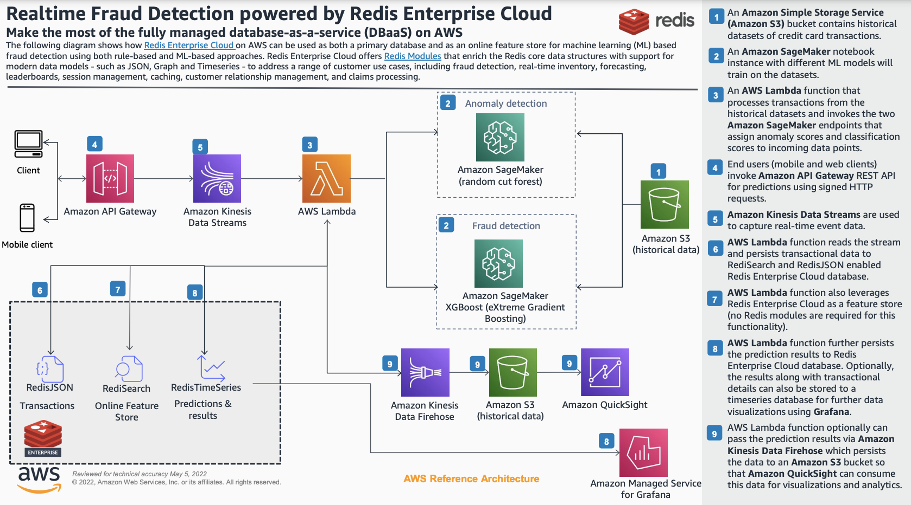

In this lab, we will do all things related to SageMaker. This includes:
- train
- test
- deploy
machine learning models using Amazon SageMaker.

In addition, we will also publish the model endpoints so that real-time inferencing can be done on these machine learning endpoints.

## Cloud Formation Template

You will find a CloudFormation template [here](https://github.com/Redislabs-Solution-Architects/aws-fraud-detection/blob/main/aws/sagemaker/fraud-detection-using-machine-learning.template).  We will use this to create a Cloud Formation stack in AWS.

1. Download the [CloudFormation template](https://github.com/Redislabs-Solution-Architects/aws-fraud-detection/blob/main/aws/sagemaker/fraud-detection-using-machine-learning.template) to your local desktop/Mac, by clicking on the download button shown here.
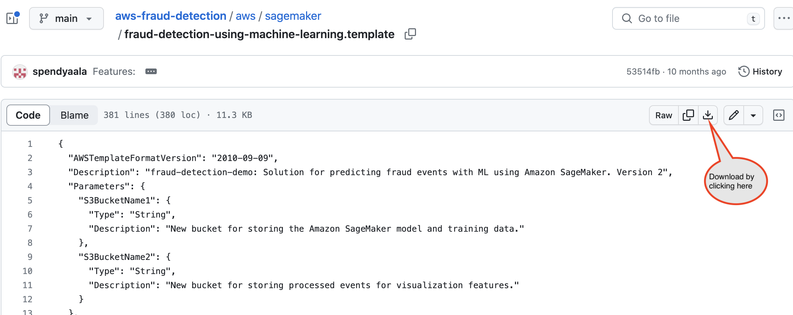

2. In the AWS console, select CloudFormation service.

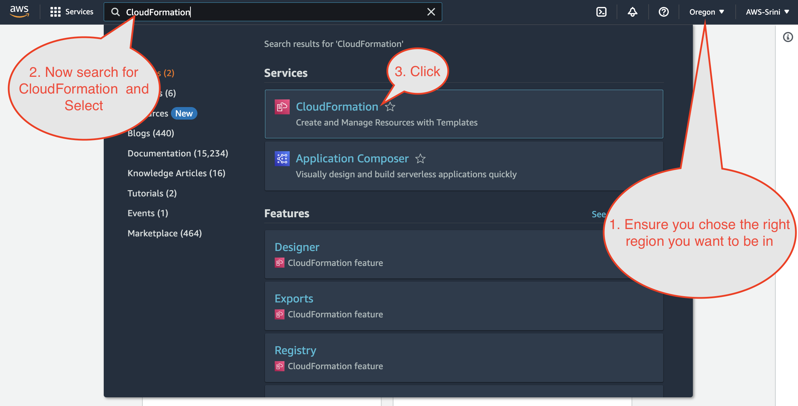

3. Click create stack

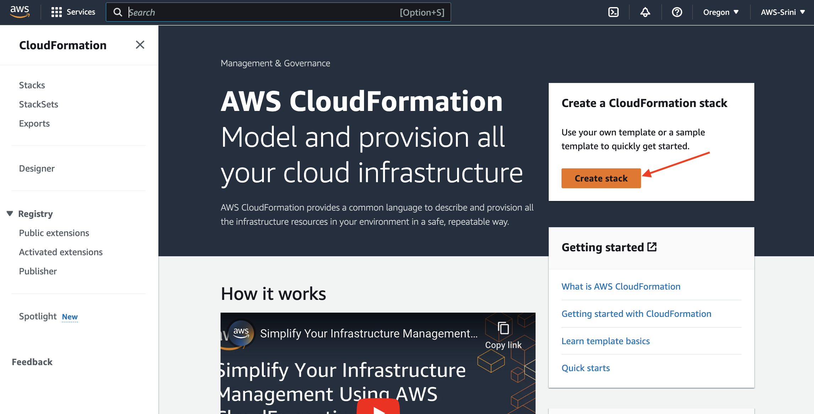

4. Upload the template from step#1 from your local machine.

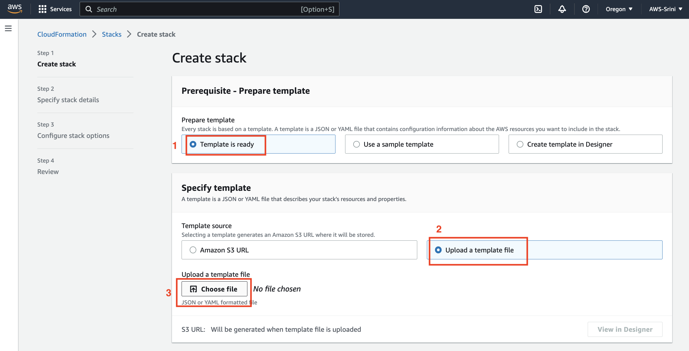

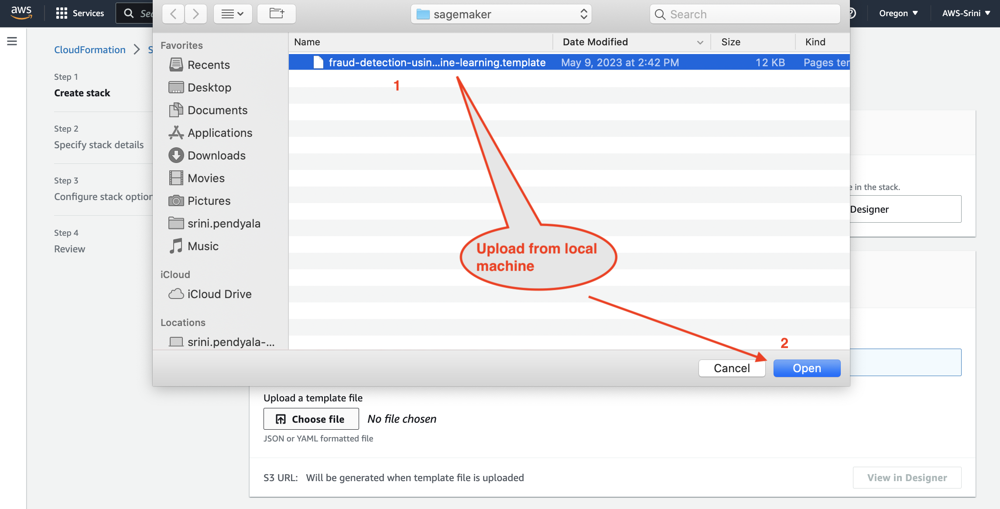

Click next

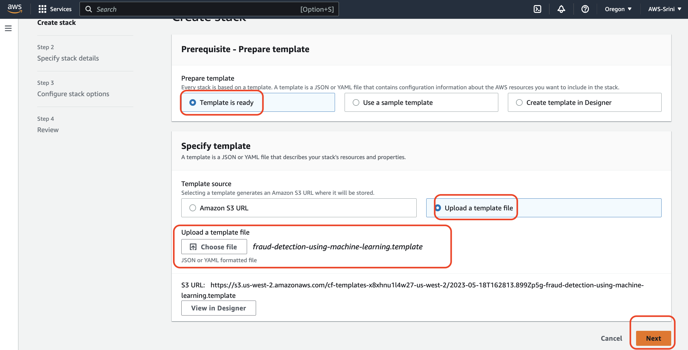

5. Give stack a name. Also configure the Amazon S3 bucket names, as shown below.

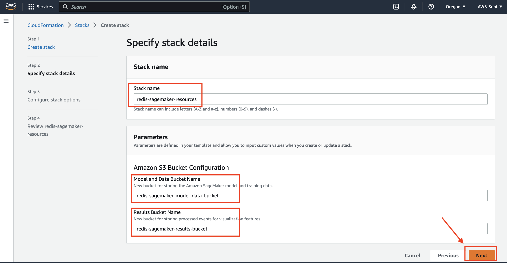

6. Ensure Rollback is selected.

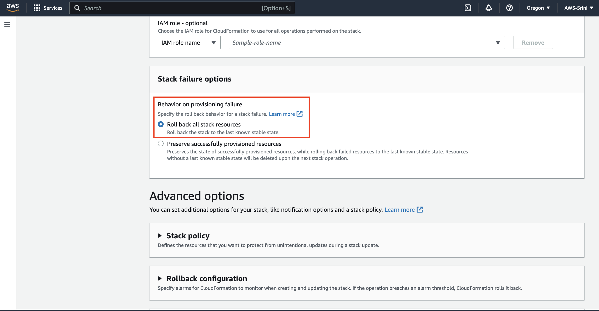

7. And then click Next

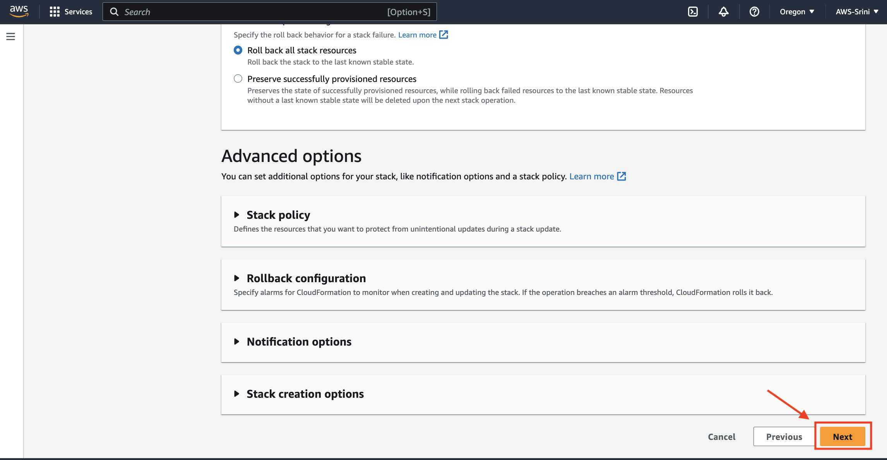

8. CloudFormation stack gets kicked-off with the status = `CREATE_IN_PROGRESS`

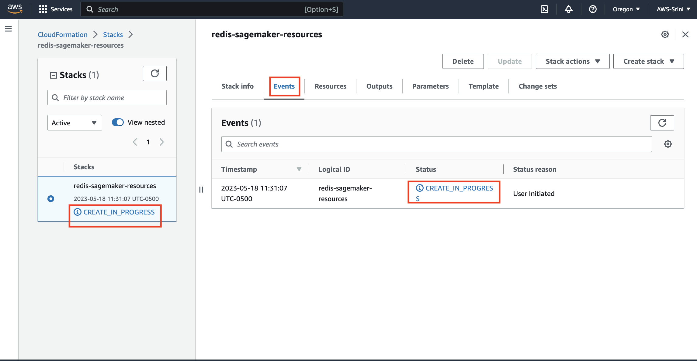

9. Let this run for 5 mins or so. While the cloud resources creation is in progress, you can click on the `Resources` tab to see Cloud resources being provisioned in real time.

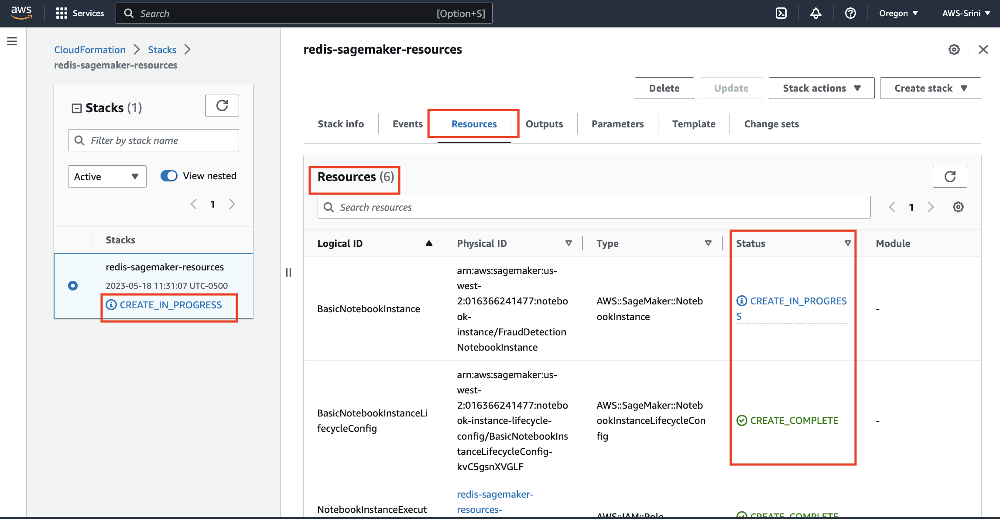

10. Switch to `Stack info` tab and wait for the stack creation to complete.

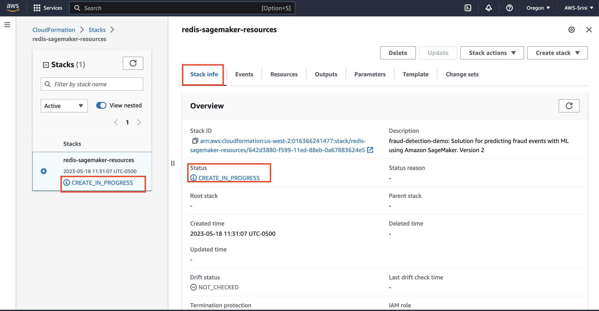

11. Now its complete.

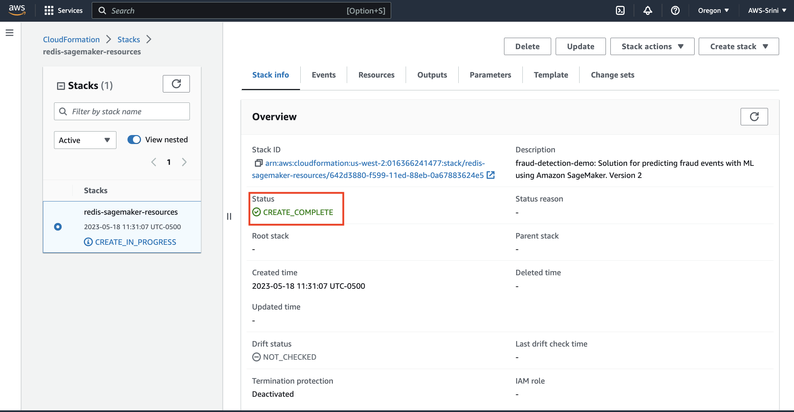

12. If you switch back to the `Resources` tab, you will see all of the cloud resources that were provisioned.

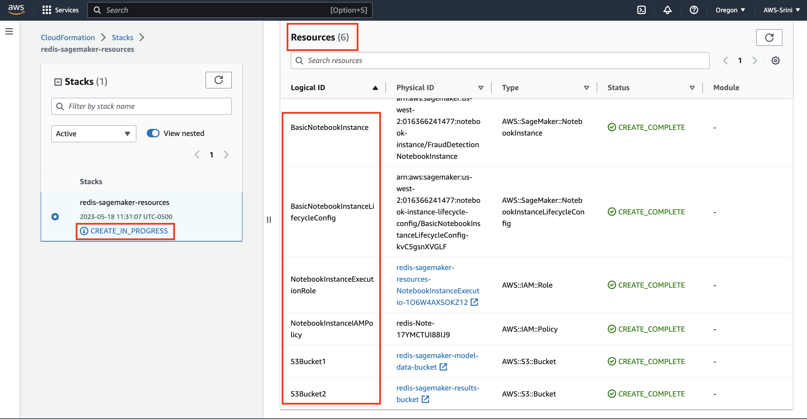

13. In the AWS web console, search for `SageMaker` and right click in the results to open `SageMaker` in a new window.

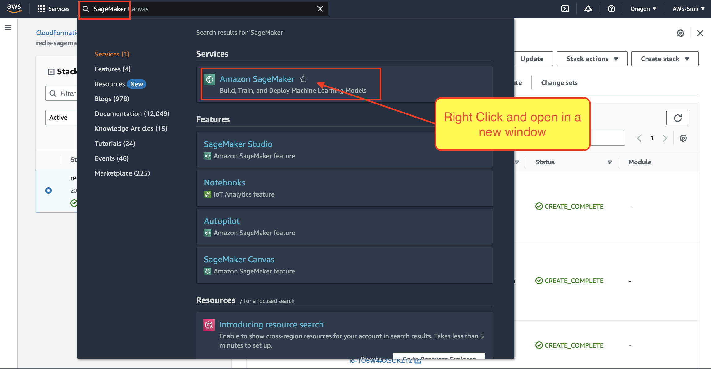

14. Navigate yourself to `Amazon SageMaker` ==> `Notebook Instances`. Click on the notebook that got provisioned with your CloudFormation template.

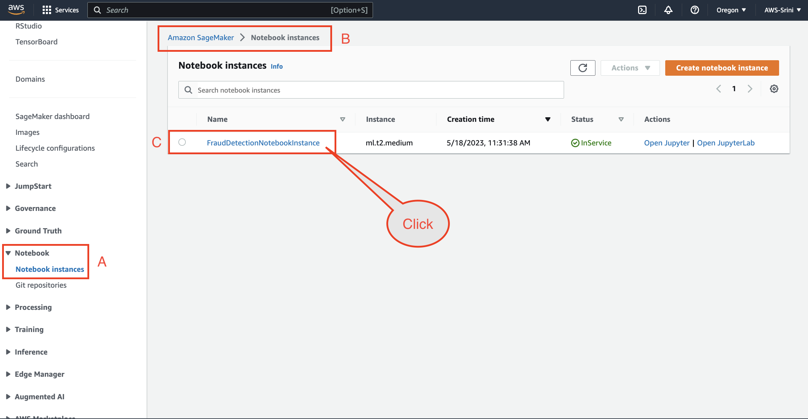

15. Open the Python Jupyter Lab. This will open in a new tab.

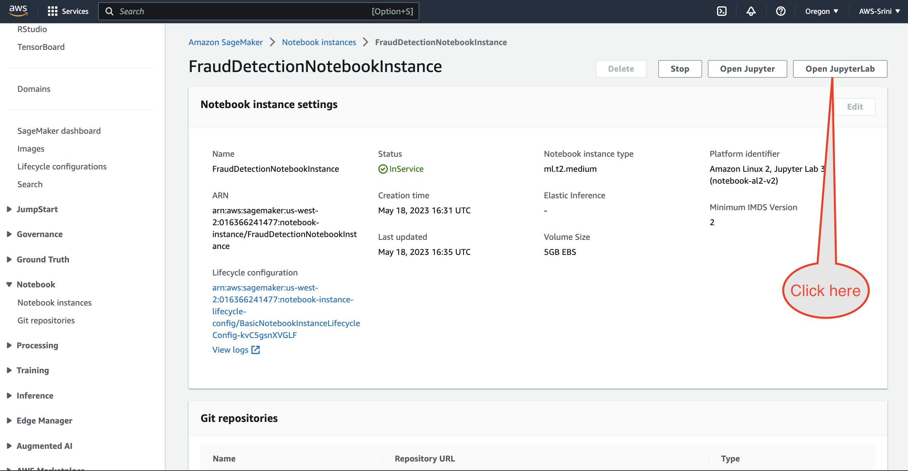

16. Now you have just now launched a Python Jupyter Lab. In the left hand navigation bar, you will see the Jupyter Notebook. Please double click on it to open it.

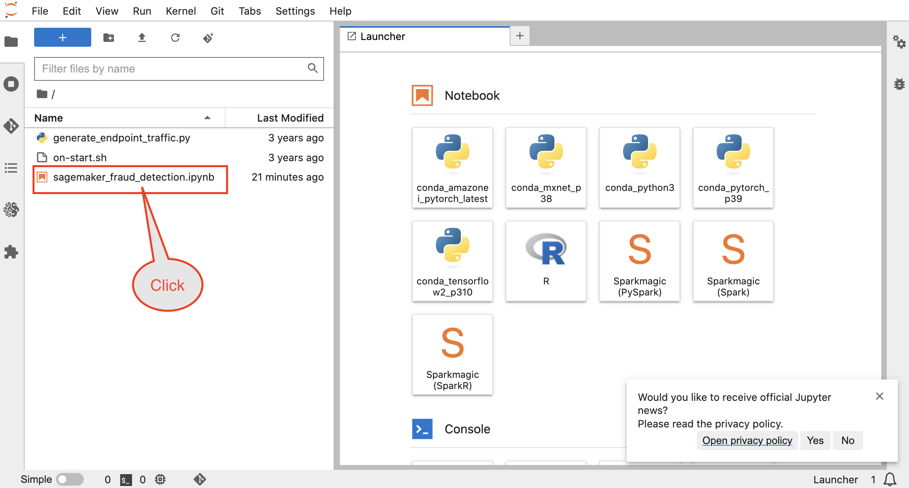

17. This opens up Jupyter Notebook in the right hand side main window. Each cell highlighted has a python code that will be executed when you press `COMMAND` + `ENTER` on a Mac OR `Cntrl` + `ENTER` on a Window's machine.

You are now ready to run the Amazon SageMaker Notebook. You will create the following cloud resources, when you do so:

* Model training jobs for Random Cut Forest & XGBoost algorithms
* Deployed Model endpoint configurations and Model endpoints
* S3 buckets that has the input and output buckets with trained data and results

See you in the next lab.
