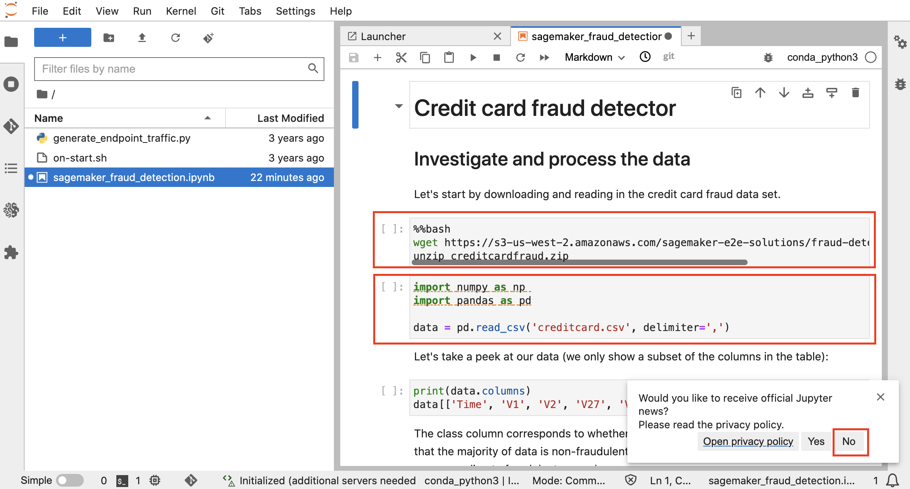

# Test, Train and Deploy SageMaker Models and Endpoints

In this lab, you are now ready to run the Amazon SageMaker Notebook. You will create the following cloud resources, when you do so:

* Model training jobs for Random Cut Forest & XGBoost algorithms
* Deployed Model endpoint configurations and Model endpoints
* S3 buckets that has the input and output buckets with trained data and results

So, lets get started.

01. Each cell highlighted has a python code that will be executed when you press `COMMAND` + `ENTER` on a Mac OR `Cntrl` + `ENTER` on a Window's machine.
We are going to run this notebook, cell by cell in a sequential manner, after ensuring that the previous step is executed.

01. dfdf

)

01. dfdf

01. dfdf

01. dfdf

01. dfdf

01. dfdf

01. dfdf

01. dfdf

01. dfdf

