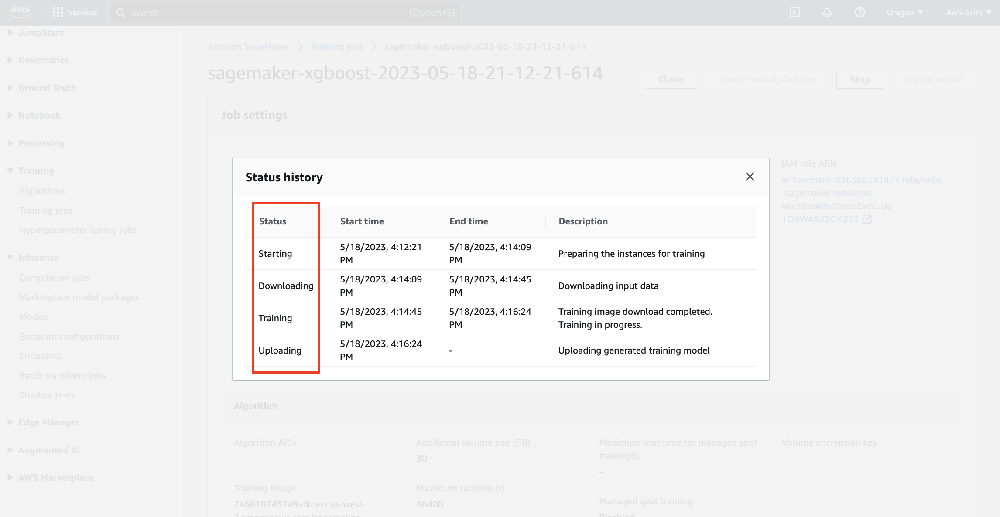

# Train, Test and Deploy SageMaker Models and Endpoints

In this lab, you are now ready to run the Amazon SageMaker Notebook. You will create the following cloud resources, when you do so:

* Model training jobs for Random Cut Forest & XGBoost algorithms
* Deployed Model endpoint configurations and Model endpoints
* S3 buckets that has the input and output buckets with trained data and results

So, lets get started.

01. Each cell highlighted has a python code that will be executed when you press `COMMAND` + `ENTER` on a Mac OR `Cntrl` + `ENTER` on a Window's machine.
We are going to run this notebook, cell by cell in a sequential manner, after ensuring that the previous step is executed.

To understand if a specific cell has been executed or not, please notice the `[ ]` in each cell.
- `[ ]` indicates that the cell has not been executed yet. (`Not started` state)
- `[*]` indicates that the current cell code is being executed (`In Progress` state)
- `[5]` any number (ex: 5) indicates that the cell has been executed.(`Execution Completed` state)

02. dfdf

03. dfdf

04. dfdf

05. dfdf

06. dfdf

07. dfdf

08. dfdf

09. dfdf

10. dfdf

11. dfdf

12. dfdf

13. dfdf

14. dfdf

15. dfdf

16. dfdf

17. dfdf

18. dfdf

19. dfdf

20. dfdf

21. dfdf

22. dfdf

23. dfdf

24. dfdf

25. dfdf

26. dfdf

27. dfdf

28. dfdf

29. dfdf

30. dfdf

31. dfdf

32. dfdf

33. dfdf

34. dfdf

35. dfdf

36. dfdf

37. dfdf

38. dfdf

39. dfdf

40. dfdf

41. dfdf

42. dfdf

43. dfdf

44. dfdf

45. dfdf

46. dfdf

47. dfdf

48. dfdf

49. dfdf

50. dfdf

51. dfdf

52. dfdf

53. dfdf

54. dfdf

