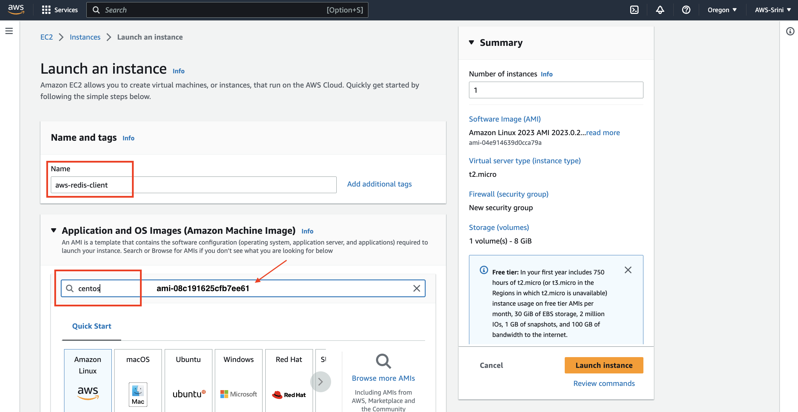
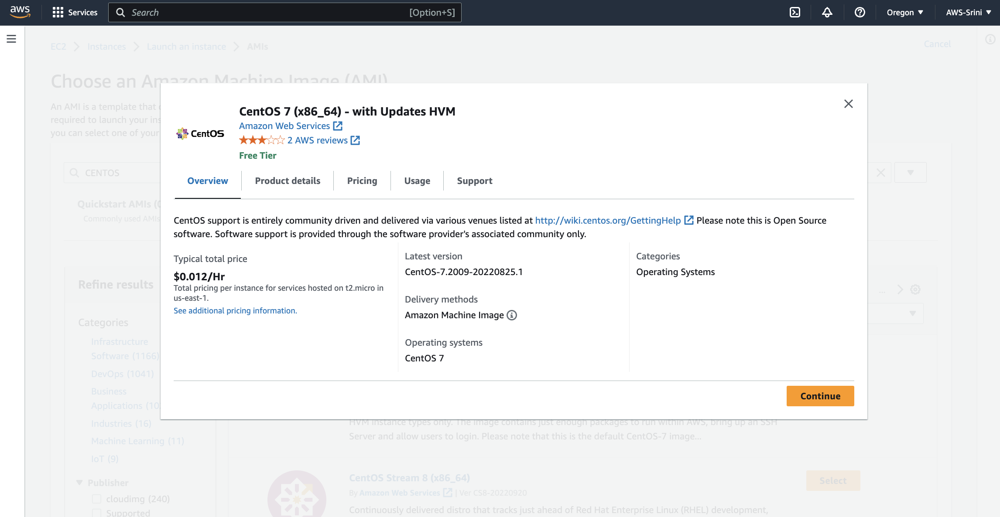
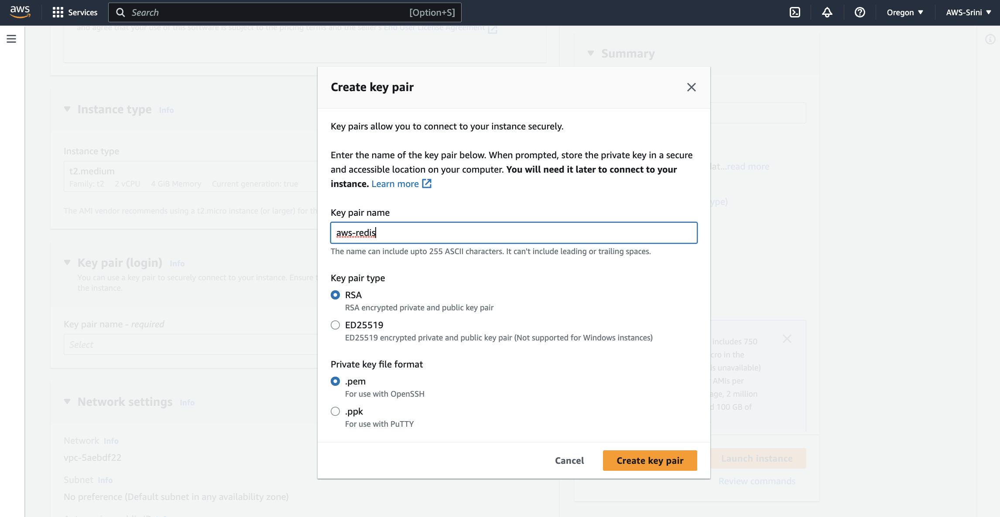
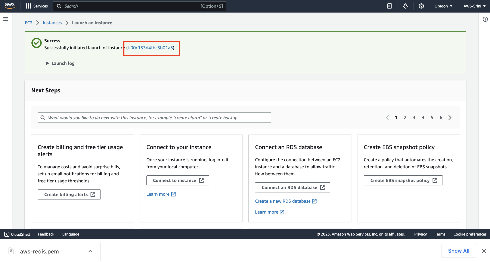
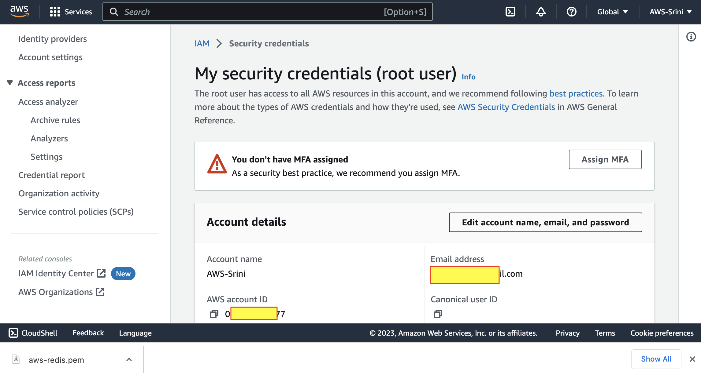

# Lab 03 - Build and Deploy Lambda function

In this lab, you are going to :
* Prepare environment for building a docker container that house a lambda function
* Build lambda function as a Docker container and upload the docker image to `Elastic Container Registry`
* Configure the Lambda function using the docker image uploaded in to `Elastic Container Registry`


## Prepare environment

1. Lets start with creating an EC2 machine that will be used as client machine for our Fraud detection system. You will understand this in the subsequent labs.


2. Navigate yourself to EC2 dashboard


3. Launch an instance. Give it a name and search for Centos AMIs.



4. In the search results, navigate to `Marketplace AMIs` and select CentOS 7x for x86_64 architecture, as shown.


5. Continue further



6. Choose instance type as "t2-medium"


7. Create a new key-value pair.


8. Give it a name, key pair type and file format, as shown.



9. As soon as you exit out of this screen, the `.pem` file will be downloaded to your local machine.


10. Create a `Security Group` and allow `SSH Traffic` from `My IP`


11. Configure storage as shown


12. Launch Instance




13. Get the Public IP details to access it via SSH terminal from your local machine.


14. Open a Terminal Window and secure your `.pem` file, to be used with your SSH sessions

```
mv ~/Downloads/aws-redis.pem ~/.ssh/
chmod 400 ~/.ssh/aws-redis.pem
```

15. Invoke SSH session using `ssh` command. Here is an example for a typical public IP address of an ec2 machine.

```
ssh -i "~/.ssh/aws-redis.pem" centos@ec2-35-93-64-166.us-west-2.compute.amazonaws.com
```
Here is how it would look like, if you have logged in successfully.


12. Lets go ahead and install a few pre-requisite packages. We will start with generic utilities.
```
sudo yum install -y yum-utils
```
```
sudo yum-config-manager \
    --add-repo \
    https://download.docker.com/linux/centos/docker-ce.repo
```
13. Install Docker and Docker Compose.

```
sudo yum install -y docker-ce docker-ce-cli containerd.io docker-compose-plugin
```
```
sudo systemctl start docker
```

```
sudo curl -L "https://github.com/docker/compose/releases/download/v2.1.1/docker-compose-$(uname -s)-$(uname -m)" -o /usr/local/bin/docker-compose
```
```
sudo chmod +x /usr/local/bin/docker-compose
```

```
sudo groupadd docker
sudo usermod -aG docker ${USER}
exit
```
The `exit` command above, will exit you out of SSH session. This is done to re-login again.

Re-login using SSH command you already used. Here is an example:
```
ssh -i "~/.ssh/aws-redis.pem" centos@ec2-35-93-64-166.us-west-2.compute.amazonaws.com
```
Once you logged in, start Docker service.

```
sudo systemctl start docker
```

14. Install Git, wget, python

```
sudo yum install git -y
sudo yum install wget -y
sudo yum install -y python3
sudo yum install unzip -y

```

15. Lets install AWS CLI.
```
curl "https://awscli.amazonaws.com/awscli-exe-linux-x86_64.zip" -o "awscliv2.zip"
unzip awscliv2.zip
sudo ./aws/install
aws --version
```

16. Lets configure your AWS CLI.
```
aws configure
```
This tool will prompt you to enter the following information, to configure your CLI:
- `AWS Access Key ID [None]:`
- `AWS Secret Access Key [None]`
- `Default region name [None]:`
- `Default output format [None]:`

You can get your `AWS Access Key ID` and `AWS Secret Access Key` from the AWS Webconsole.

Go to `IAM` ==> `Security Credentials`



Go to `Access keys` section and create one.


We are not building a Production system. Ignore this warning by click on `I understand...` and move forward by clicking on `Create access key`


Once the access key is created, take a note of them from this screen. You will need it to configure your AWS CLI.


Now feed this information to your `aws configure` tool. Here is a typical example:

> NOTE: Do not execute the following snippet. Its just an example of a typical output.
```
[centos@ip-172-31-9-71 lamdba]$ aws configure
AWS Access Key ID [None]: AKIAKERWRWQHTGFSFGF
AWS Secret Access Key [None]: 3+QBPqZEWIFOo5FF0oODFEDgb0Yx4Uk9pcM0MvY
Default region name [None]: us-west-2
Default output format [None]:
```

## Build Lambda function as a Docker container

1. Let us clone the `Fraud Detection` codebase to this ec2 machine.
```
git clone https://github.com/Redislabs-Solution-Architects/aws-fraud-detection.git
```

2. Navigate yourself in to lambda folder in this repo.
```
cd aws-fraud-detection/aws/lamdba
```
3. We are going to build a `Docker` container and upload it to the `Elastic Container Registry`. Lets edit `lambda_configs.properties` to reflect your Redis Enterprise Cloud endpoints.

> At this point of time, please ask your instructor to provide you Redis Enterprise Cloud Database Endpoints that you are going to use for the rest of the labs.

Here is an example `lambda_configs.properties`, once you edit with the correct details.
> NOTE: Do not execute the following snippet. Its just an example of a typical configuration >file. Not an executing code or script. Also please use the Redis Host, port and Password info provided by your instructor.


```
[DEMO]
INSTALL_DIR=/home/centos/aws-fraud-detection

[REDIS]
REDIS_HOST=redis-11702.c25049.us-west-2-1.ec2.cloud.rlrcp.com
REDIS_PORT=11702
REDIS_PWD=3qAml8eWZ0WHnHRG0qzhMoeRPlCv17Pw
```

4. Lets create a ECR Repository, by going to `Amazon ECR` ==> `Repositories`.
Click `Create Repository`


5. Make it private and give it a name.


6. To push the docker container image to this repository, simply navigate yourself in to `Amazon ECR` ==> `Repositories` ==> aws-redis-lambda. And click on `View Push Commands`.


Execute these commands to authenticate your aws cli to the repository, build docker container image and push the container image to the repository.

Example commands:

Make sure you are in the `lambda` folder first.
```
cd  /home/centos/aws-fraud-detection/aws/lamdba
```

```
aws ecr get-login-password --region us-west-2 | docker login --username AWS --password-stdin 016366241477.dkr.ecr.us-west-2.amazonaws.com

docker build -t aws-redis-lambda .

docker tag aws-redis-lambda:latest 016366241477.dkr.ecr.us-west-2.amazonaws.com/aws-redis-lambda:latest

docker push 016366241477.dkr.ecr.us-west-2.amazonaws.com/aws-redis-lambda:latest
```

4. After the container is uploaded in to the `Elastic Container Repository`, you can see the container image as shown below:


## Configure Lambda function using the Docker Image

1. Lets start with searching for `Lambda` service in your AWS Web console.


2. Click on `Create function`


3. Choose from `Container image`, give it a name like `aws-redis-fraud-detection-processor` and then click on the `Browse images`


4. Select the repository from the drop down : `aws-redis-lambda`. Remember we pushed our Docker container image to this repo in the previous task.


5. Select the image with the tag `latest`


6. Make sure everything is good with your Lambda configuration. Check the name, `Container image` check etc.


7. Choose `x86)64` for architecture and click `Create function`


8. Sometimes, you may run into errors like this:
```
Lambda was unable to configure access to your environment variables because the KMS key is invalid for CreateGrant. Please check your KMS key settings. KMS Exception: InvalidArnException KMS Message: ARN does not refer to a valid principal: arn:aws:sts::016366241477:assumed-role/aws-redis-fraud-detection-processor-role-u6yvywrh/aws-redis-fraud-detection-processor
```


Simply expand `Change default execution role` and choose `Create new role with basic lamdba permissions`


9. If everything goes well, you `lambda` function is successfully configured and ready to be used.


## Conclusion

In summary, you have accomplished following tasks In this lab :
* Prepare environment for building a docker container that house a lambda function
* Build lambda function as a Docker container and upload the docker image to `Elastic Container Registry`
* Configure the Lambda function using the docker image uploaded in to `Elastic Container Registry`

See you in the next lab.  [Go back](..)
