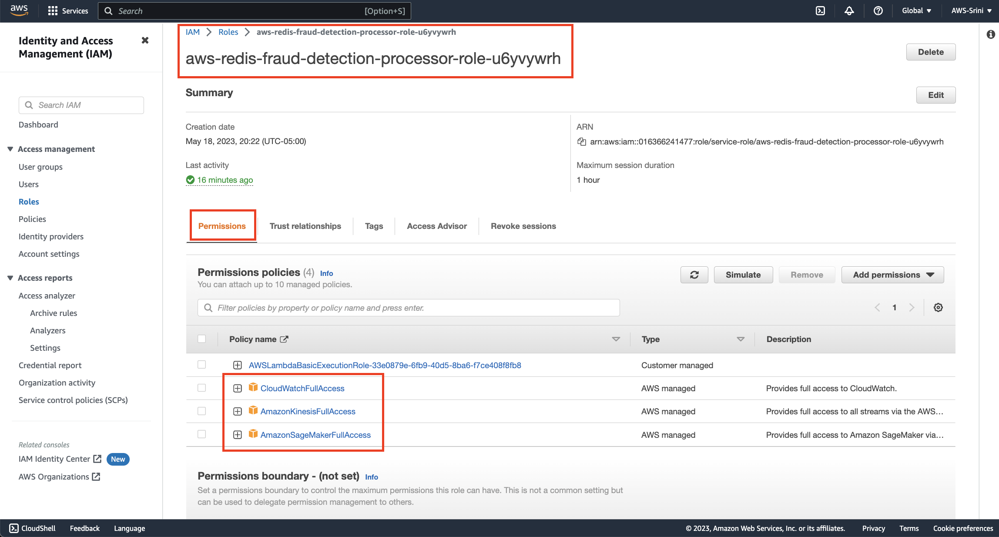

# Amazon Kinesis

In this lab, you are going to :
* Configure Amazon Kinesis Data stream, to capture the real-time financial transactions from end-users.
* Configure Amazon Kinesis data stream to trigger AWS lambda function, to invoke fraud detection.


## Configure Amazon Kinesis Data Stream

1. Start by searching for `Kinesis` in your AWS Web console


2. Click on `Create data stream`


3. Create data stream by giving it a name : `demo-stream`.
Choose capcity mode as `On-Demand`.


4. Go ahead and create the datastream.


5. After you successfully created the data stream, you will see a successful message.


## Configure Lambda Trigger

1. Navigate back yourself to the `Lambda` ==> `Functions` ==>  `aws-redis-fraud-detection-processor`. Click on the `Add trigger`


2. Search for `Kinesis`


3. Search for your data stream and select `demo-stream`


4. Setup the batch size as 1 instead of 100, just to simulate kinesis reading one transaction at a time.


5. Sometimes, if you do not have enough previleges, you may encounter an error like this.
```
An error occurred when creating the trigger: Cannot access stream arn:aws:kinesis:us-west-2:016366241477:stream/demo-stream. Please ensure the role can perform the GetRecords, GetShardIterator, DescribeStream, ListShards, and ListStreams Actions on your stream in IAM.
```


6. To resolve this error, navigate back to your lambda function ( `Lambda` ==> `Functions` ==> `aws-redis-fraud-detection-processor`). Click on the `Configuration` tab.


7. Click on `Permissions` and click on the `Role name` that will open the `Role` properties page in a seperate window.


8. Here, go ahead and add permissions.


9. Search for `Kinesis` and add `AmazonKinesisFullAccess` permission.


10. Click on `Add permissions`


11. Similarly, search for `Cloudwatch` and add `CloudWatchFullAccess` permission


12. After adding these two permissions, your `Permission policies` for your lambda role should have these permissions added.



13. Now go back to your Lambda function and try adding the trigger again, by clicking on the `Add trigger` button.


14. Go ahead and configure Kinesis as the trigger with batch size = `1` and `Latest` as the starting position


15. If everything goes well, your trigger is configured successfully as shown below.


## Conclusion
In summary, you have done the following things in this lab:
* You have configured `Amazon Kinesis Data stream`, to capture the real-time financial transactions from end-users.
* You have configurde `Amazon Kinesis data stream` to trigger `AWS lambda` function, to invoke fraud detection.

See you in the next lab.  [Go back](..)
