# Lab 05 - Run Fraud Detection in Real-time

Duration: 30 mins

In this lab, you are going to :
* Configure Python Virtual Environment required as a pre-requisite to simulate thousands of transactional events data to our Fraud detection system.
* Run Fraud Detection data producer to simulate end user transactions.
* Deep-dive on Lambda function, to understand how the incoming data is fraud detected and the results are persisted in the Redis Enterprise Cloud.

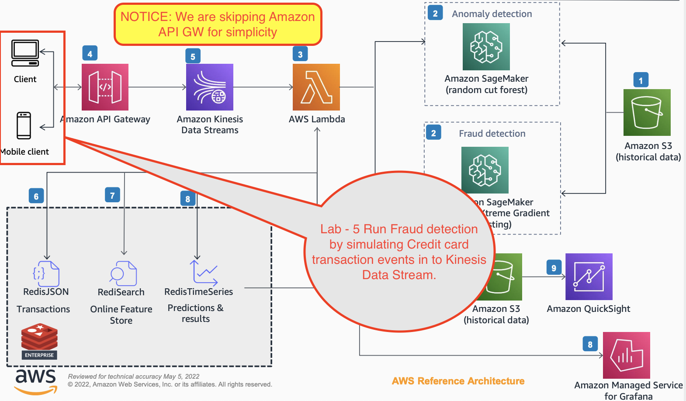

## Configure Python Virtual Environment

1. Invoke SSH session using `ssh` command. Here is an example for a typical public IP address of an ec2 machine.

```
ssh -i "~/.ssh/aws-redis.pem" centos@ec2-35-93-64-166.us-west-2.compute.amazonaws.com
```
Here is how it would look like, if you have logged in successfully.

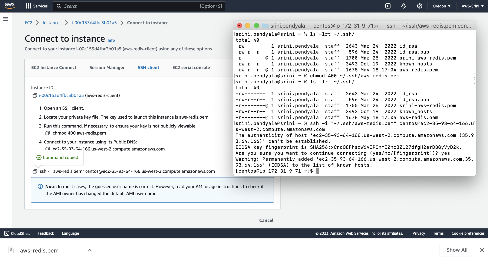


2. Navigate yourself to application INSTALL_DIR (ex: `INSTALL_DIR=/home/centos/aws-fraud-detection`). Go ahead and enable a Python virtual environment.

```
python3 -m venv aws-fraud-detection.venv
source aws-fraud-detection.venv/bin/activate
```

Notice `(aws-fraud-detection.venv)` being displayed before the command prompt. This indicates that the Python Virtual environment is enabled for you.
Example:
```
(aws-fraud-detection.venv) [centos@ip-172-31-9-71 aws-fraud-detection]$
```

3. Now lets install Python dependencies.
```
pip install --upgrade pip
pip install -r requirements-centos7.txt
```

Here is an example typical output:

```
[centos@ip-172-31-9-71 aws-fraud-detection]$ pwd
/home/centos/aws-fraud-detection
[centos@ip-172-31-9-71 aws-fraud-detection]$ python3 -m venv aws-fraud-detection.venv
[centos@ip-172-31-9-71 aws-fraud-detection]$ source aws-fraud-detection.venv/bin/activate
(aws-fraud-detection.venv) [centos@ip-172-31-9-71 aws-fraud-detection]$ pip install -r requirements-centos7.txt
Collecting async-timeout==4.0.2 (from -r requirements-centos7.txt (line 1))
  Downloading https://files.pythonhosted.org/packages/d6/c1/8991e7c5385b897b8c020cdaad718c5b087a6626d1d11a23e1ea87e325a7/async_timeout-4.0.2-py3-none-any.whl
Collecting aws-requests-auth==0.4.3 (from -r requirements-centos7.txt (line 2))
  Downloading https://files.pythonhosted.org/packages/af/11/5dc8be418e1d54bed15eaf3a7461797e5ebb9e6a34869ad750561f35fa5b/aws_requests_auth-0.4.3-py2.py3-none-any.whl
Collecting boto==2.49.0 (from -r requirements-centos7.txt (line 3))
  Downloading https://files.pythonhosted.org/packages/23/10/c0b78c27298029e4454a472a1919bde20cb182dab1662cec7f2ca1dcc523/boto-2.49.0-py2.py3-none-any.whl (1.4MB)
    100% |████████████████████████████████| 1.4MB 931kB/s
Collecting boto-utils==0.3 (from -r requirements-centos7.txt (line 4))
  Downloading https://files.pythonhosted.org/packages/24/e6/8a6b09fc020b85d7e276b8451c6a4f60ff747c73143c8f3bdfe35d9ffb24/boto_utils-0.3.tar.gz
Collecting boto3==1.21.25 (from -r requirements-centos7.txt (line 5))
  Downloading https://files.pythonhosted.org/packages/1f/9b/78a23056e6d485c155bb7f327c2f90511003df791254c6843085ff06ce0b/boto3-1.21.25-py3-none-any.whl (132kB)
    100% |████████████████████████████████| 133kB 8.3MB/s
Collecting botocore==1.24.25 (from -r requirements-centos7.txt (line 6))
  Downloading https://files.pythonhosted.org/packages/e0/27/23d9260d1b4a5323a73cddee82ed0ecde130c1b576479faa196feed8f51f/botocore-1.24.25-py3-none-any.whl (8.6MB)
    100% |████████████████████████████████| 8.6MB 151kB/s
Collecting certifi==2022.6.15 (from -r requirements-centos7.txt (line 7))
  Downloading https://files.pythonhosted.org/packages/e9/06/d3d367b7af6305b16f0d28ae2aaeb86154fa91f144f036c2d5002a5a202b/certifi-2022.6.15-py3-none-any.whl (160kB)
    100% |████████████████████████████████| 163kB 6.9MB/s
Collecting charset-normalizer==2.1.0 (from -r requirements-centos7.txt (line 8))
  Downloading https://files.pythonhosted.org/packages/94/69/64b11e8c2fb21f08634468caef885112e682b0ebe2908e74d3616eb1c113/charset_normalizer-2.1.0-py3-none-any.whl
Collecting configparse==0.1.5 (from -r requirements-centos7.txt (line 9))
  Downloading https://files.pythonhosted.org/packages/5b/ee/0bf6d28248c0cf5b5820405693952f611ce6696b65d289cd1bc1781969f7/configparse-0.1.5-py3-none-any.whl
Collecting Deprecated==1.2.13 (from -r requirements-centos7.txt (line 10))
  Downloading https://files.pythonhosted.org/packages/51/6a/c3a0408646408f7283b7bc550c30a32cc791181ec4618592eec13e066ce3/Deprecated-1.2.13-py2.py3-none-any.whl
Collecting idna==3.3 (from -r requirements-centos7.txt (line 11))
  Downloading https://files.pythonhosted.org/packages/04/a2/d918dcd22354d8958fe113e1a3630137e0fc8b44859ade3063982eacd2a4/idna-3.3-py3-none-any.whl (61kB)
    100% |████████████████████████████████| 61kB 9.4MB/s
Collecting jmespath==1.0.0 (from -r requirements-centos7.txt (line 12))
  Could not find a version that satisfies the requirement jmespath==1.0.0 (from -r requirements-centos7.txt (line 12)) (from versions: 0.0.1, 0.0.2, 0.0.3, 0.1.0, 0.2.0, 0.2.1, 0.3.0, 0.3.1, 0.4.0, 0.4.1, 0.5.0, 0.6.0, 0.6.1, 0.6.2, 0.7.0, 0.7.1, 0.8.0, 0.9.0, 0.9.1, 0.9.2, 0.9.3, 0.9.4, 0.9.5, 0.10.0)
No matching distribution found for jmespath==1.0.0 (from -r requirements-centos7.txt (line 12))
You are using pip version 9.0.3, however version 23.1.2 is available.
You should consider upgrading via the 'pip install --upgrade pip' command.
(aws-fraud-detection.venv) [centos@ip-172-31-9-71 aws-fraud-detection]$

```
If the above output suggests you run `pip install --upgrade pip`, lets do that. Here is a typical output:

```
(aws-fraud-detection.venv) [centos@ip-172-31-9-71 aws-fraud-detection]$ pip install --upgrade pip
Collecting pip
  Downloading https://files.pythonhosted.org/packages/a4/6d/6463d49a933f547439d6b5b98b46af8742cc03ae83543e4d7688c2420f8b/pip-21.3.1-py3-none-any.whl (1.7MB)
    100% |████████████████████████████████| 1.7MB 746kB/s
Installing collected packages: pip
  Found existing installation: pip 9.0.3
    Uninstalling pip-9.0.3:
      Successfully uninstalled pip-9.0.3
Successfully installed pip-21.3.1
You are using pip version 21.3.1, however version 23.1.2 is available.
You should consider upgrading via the 'pip install --upgrade pip' command.
```

Since we have upgraded `pip`, lets re-run `pip install`

```
pip install -r requirements-centos7.txt
```

If you encounter pip install errors, resolve them. Example:

```
(aws-fraud-detection.venv) [centos@ip-172-31-9-71 aws-fraud-detection]$ pip install -r requirements-centos7.txt
Collecting async-timeout==4.0.2
  Using cached async_timeout-4.0.2-py3-none-any.whl (5.8 kB)
Collecting aws-requests-auth==0.4.3
  Using cached aws_requests_auth-0.4.3-py2.py3-none-any.whl (6.8 kB)
Collecting boto==2.49.0
  Using cached boto-2.49.0-py2.py3-none-any.whl (1.4 MB)
Collecting boto-utils==0.3
  Using cached boto_utils-0.3.tar.gz (7.0 kB)
  Preparing metadata (setup.py) ... done
Collecting boto3==1.21.25
  Using cached boto3-1.21.25-py3-none-any.whl (132 kB)
Collecting botocore==1.24.25
  Using cached botocore-1.24.25-py3-none-any.whl (8.6 MB)
Collecting certifi==2022.6.15
  Using cached certifi-2022.6.15-py3-none-any.whl (160 kB)
Collecting charset-normalizer==2.1.0
  Using cached charset_normalizer-2.1.0-py3-none-any.whl (39 kB)
Collecting configparse==0.1.5
  Using cached configparse-0.1.5-py3-none-any.whl (7.2 kB)
Collecting Deprecated==1.2.13
  Using cached Deprecated-1.2.13-py2.py3-none-any.whl (9.6 kB)
Collecting idna==3.3
  Using cached idna-3.3-py3-none-any.whl (61 kB)
ERROR: Could not find a version that satisfies the requirement jmespath==1.0.0 (from versions: 0.0.1, 0.0.2, 0.0.3, 0.1.0, 0.2.0, 0.2.1, 0.3.0, 0.3.1, 0.4.0, 0.4.1, 0.5.0, 0.6.0, 0.6.1, 0.6.2, 0.7.0, 0.7.1, 0.8.0, 0.9.0, 0.9.1, 0.9.2, 0.9.3, 0.9.4, 0.9.5, 0.10.0)
ERROR: No matching distribution found for jmespath==1.0.0
```
To resolve above problem, edit `requirements-centos7.txt` appropriately.
Example: here you can see that the `jmespath` library version dependency is removed by commenting it out on the first line and added a new line without version number.
```
#jmespath==1.0.0
jmespath
```
Re-run `pip install -r requirements-centos7.txt` until you resolve all of such dependency errors.

On Centos, you may need to adopt the following `requirements-centos7.txt` file with  

4. Next, we are going to simulate 1000's of transactions as if they are happening in real-time. These transactions will then be fed in to kinesis data stream so that fraud detection by the lambda function gets kicked in, in real-time.

To do this, lets get the input data needed for simulating end-user transactions.

```
cd data
wget https://s3-us-west-2.amazonaws.com/sagemaker-e2e-solutions/fraud-detection/creditcardfraud.zip
unzip creditcardfraud.zip
```

Here is a typical output on a Centos Linux machine:
```
(aws-fraud-detection.venv) [centos@ip-172-31-9-71 aws-fraud-detection]$ cd data
(aws-fraud-detection.venv) [centos@ip-172-31-9-71 data]$ wget https://s3-us-west-2.amazonaws.com/sagemaker-e2e-solutions/fraud-detection/creditcardfraud.zip
--2023-05-19 09:43:21--  https://s3-us-west-2.amazonaws.com/sagemaker-e2e-solutions/fraud-detection/creditcardfraud.zip
Resolving s3-us-west-2.amazonaws.com (s3-us-west-2.amazonaws.com)... 52.218.233.248, 3.5.86.123, 52.92.161.168, ...
Connecting to s3-us-west-2.amazonaws.com (s3-us-west-2.amazonaws.com)|52.218.233.248|:443... connected.
HTTP request sent, awaiting response... 200 OK
Length: 69155632 (66M) [application/zip]
Saving to: ‘creditcardfraud.zip’

100%[====================================================================================>] 69,155,632  79.3MB/s   in 0.8s   

2023-05-19 09:43:22 (79.3 MB/s) - ‘creditcardfraud.zip’ saved [69155632/69155632]

(aws-fraud-detection.venv) [centos@ip-172-31-9-71 data]$ unzip creditcardfraud.zip
Archive:  creditcardfraud.zip
  inflating: creditcard.csv          
(aws-fraud-detection.venv) [centos@ip-172-31-9-71 data]$
```

## Run Fraud Detection data producer

1. Now lets run the producer.
```
cd ..
python3 ./utilities/producer2.py
```
This will start producing events into an AWS kinesis stream. This is to simulate the end user events and capturing those transactions realtime for Fraud detection.

The events will immediately trigger the Lambda function and you can observe the lamdba acting on those events by
- persisting the transactions as they are in to **Redis Enterprise Cloud** database
- making inferences to the **Amazon SageMaker**
- persisting inferenced results back in to **Redis Enterprise Cloud** Timeseries database

Here is a typical output:
```
(aws-fraud-detection-demo.venv) [centos@ip-172-31-9-71 aws-fraud-detection]$ python3 ./utilities/producer2.py
**** printing features -START ******
[[ 0.0000000e+00 -1.3598071e+00 -7.2781175e-02 ...  1.3355838e-01
  -2.1053053e-02  1.4962000e+02]
 [ 0.0000000e+00  1.1918571e+00  2.6615071e-01 ... -8.9830989e-03
   1.4724169e-02  2.6900001e+00]
 [ 1.0000000e+00 -1.3583541e+00 -1.3401631e+00 ... -5.5352796e-02
  -5.9751842e-02  3.7866000e+02]
 ...
 [ 1.7278800e+05  1.9195650e+00 -3.0125386e-01 ...  4.4547720e-03
  -2.6560828e-02  6.7879997e+01]
 [ 1.7278800e+05 -2.4044006e-01  5.3048253e-01 ...  1.0882074e-01
   1.0453282e-01  1.0000000e+01]
 [ 1.7279200e+05 -5.3341252e-01 -1.8973334e-01 ... -2.4153087e-03
   1.3648914e-02  2.1700000e+02]]
**** printing features -  END ******
**** printing labels -START ******
[0. 0. 0. ... 0. 0. 0.]
**** printing labels -  END ******
*** IN generate_traffic
***** Will put this data in to kinesis datastream ******
{'data': '123609.0,2.0539093,0.022610955,-1.0428699,0.39810613,-0.0112726865,-1.1020089,0.24738728,-0.37370607,0.36806923,0.03137426,-0.49702358,1.0624133,1.1955044,0.05518086,-0.03715294,-0.21701735,-0.2965615,-1.0978199,0.066508695,-0.15756105,-0.2702192,-0.58257914,0.33314884,0.017873744,-0.2751004,0.19723734,-0.060172413,-0.058025993,1.98', 'metadata': ['2023-05-19 10:17:47', 'random_id', 'Web']}
-------------- Record START ---------------
{
    "data": "123609.0,2.0539093,0.022610955,-1.0428699,0.39810613,-0.0112726865,-1.1020089,0.24738728,-0.37370607,0.36806923,0.03137426,-0.49702358,1.0624133,1.1955044,0.05518086,-0.03715294,-0.21701735,-0.2965615,-1.0978199,0.066508695,-0.15756105,-0.2702192,-0.58257914,0.33314884,0.017873744,-0.2751004,0.19723734,-0.060172413,-0.058025993,1.98",
    "metadata": [
        "2023-05-19 10:17:47",
        "random_id",
        "Web"
    ]
}
-------------- Record END   ---------------

```


2. Lets see if the events data is making its way all the way to Kinesis. Go to `Amazon Kinesis` ==> `Data streams` ==> "demo-stream". Click on `Monitoring` and you can see a spike in the Records coming in.

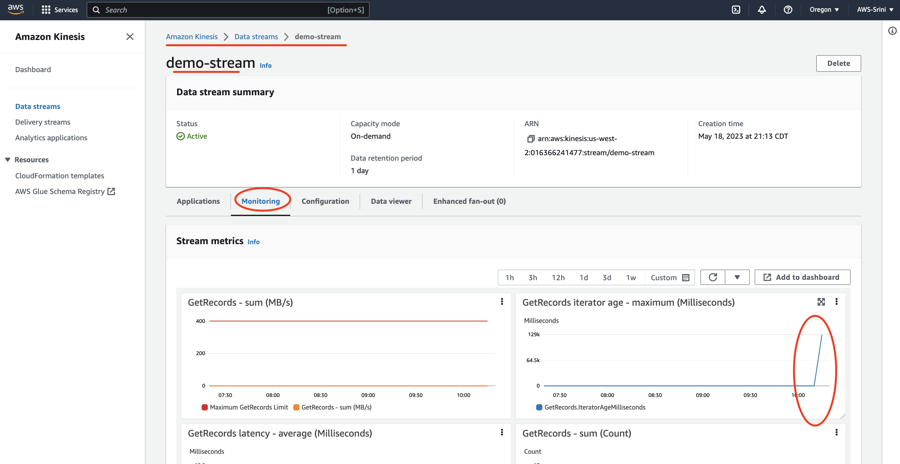

3. Go to `Data Viewer` and select a shard.

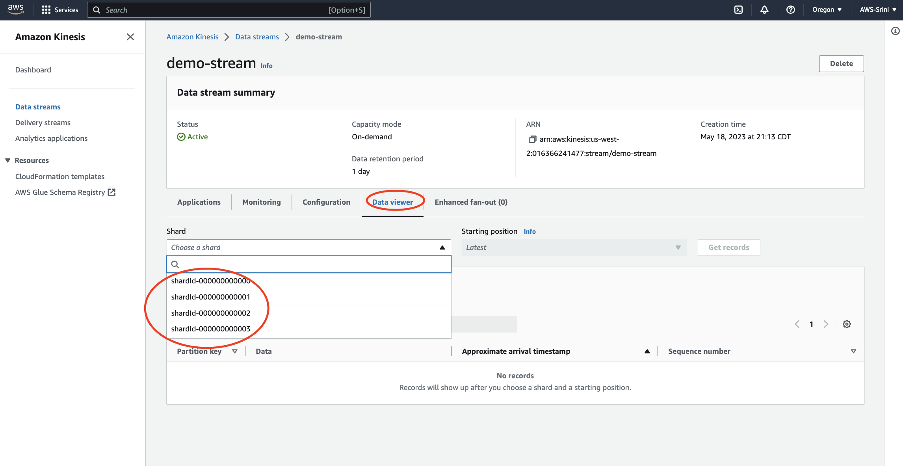

4. Select a `Starting position` option as `At timestamp`

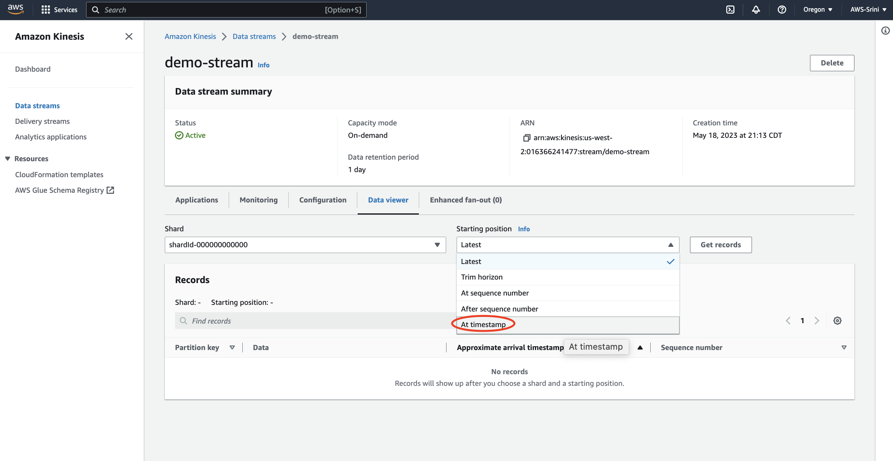

5. Now you can view the data making all the way to its Kinesis stream, for the search criterion chosen.

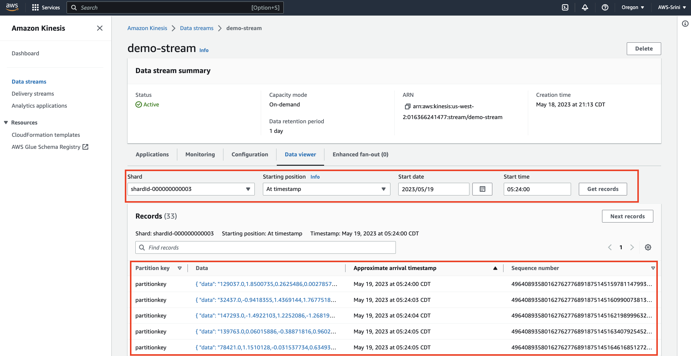

6. If you click on a data record, you can further see granular details.

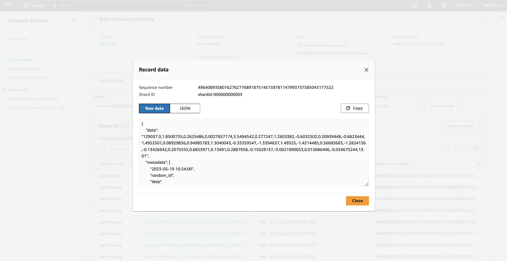

7. Now lets verify if this `Kinesis` data stream is invoking our Lambda fuction or not. Got to `Lambda` ==> `Functions` ==> "aws-redis-fraud-detection-processor". Click on `View CloudWatch Logs` link. This will open Cloudwatch logs in a seperate browser tab.


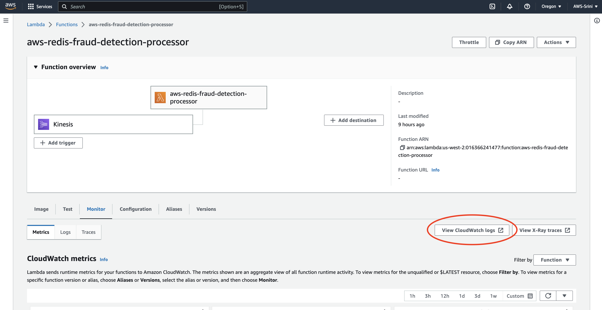

8. Click on the `Log streams`

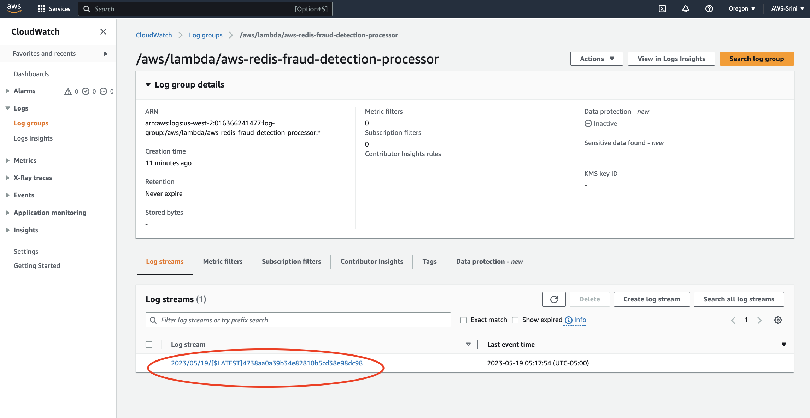

9. Here you go, you can now see the data kicking in our lambda function.

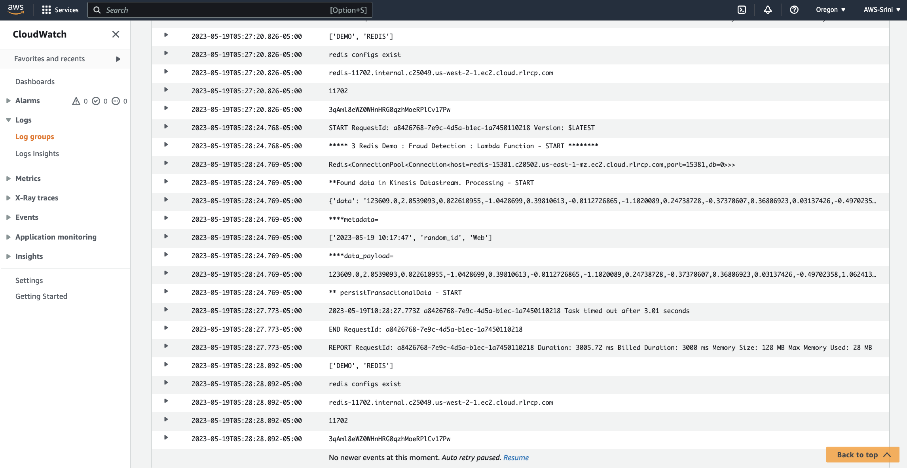

## Deep-dive on Lambda function

1. The financial transaction events will occur in realtime and are captured in Kinesis data-streams. They immediately trigger the Lambda function to process the incoming event data. The lambda function does the following operations:
- persists the transactions as they are arriving, in to **Redis Enterprise Cloud** database
- makes inferences to the **Amazon SageMaker**, to detect if a specific event is a fraudulent transaction or not.
- finally persists the inferenced results back in to **Redis Enterprise Cloud** Timeseries database, to drive Data visualization on this data in real-time.

2. Observe very carefully in the log files, how AWS lambda is processing the incoming data.

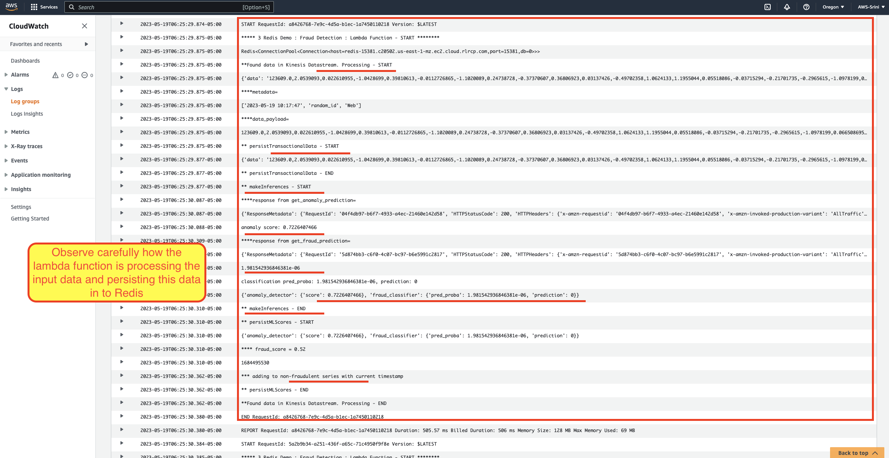

Notice the following log messages:
- Data processing for each record in the Kinesis data stream is happening between `START RequestId: a8426768-7e9c-4d5a-b1ec-1a7450110218 Version: $LATEST` and `END RequestId: a8426768-7e9c-4d5a-b1ec-1a7450110218`
- `***** 3 Redis Demo : Fraud Detection : Lambda Function - START ********` indicates that the lambda function got invoked.
- `**Found data in Kinesis Datastream. Processing - START` indicates that the Lambda function read the data from the stream.
- `** persistTransactionalData - START` indicates that the lambda function started persisting the transaction raw data in `JSON` format to Redis Enterprise Cloud on AWS.
- `** makeInferences - START` indicates that the lambda function started making inferences to the Amazon SageMaker endpoints.
- `anomaly score: 0.7352578118` and `classification pred_proba: 1.0628989912220277e-05, prediction: 0` indicates that the lambda function successfully made inferences and got the final scores.
- `** makeInferences - END` indicates that the lambda function finished making inferences in real-time to SageMaker endpoints.
- `** persistMLScores - START` indicates that the lambda function is persisting the inferenced results back to Redis Enterprise Cloud on AWS.
- `{'anomaly_detector': {'score': 0.7352578118}, 'fraud_classifier': {'pred_proba': 1.0628989912220277e-05, 'prediction': 0}}` indicates that the lambda function fetched ML scores from `anomaly_detector` and `fraud_classifier`
- `**** fraud_score = 0.89` and  `*** adding to fraudulent series with current timestamp` indicates that the lambda function is persisting the data to Timeseries database for Data Visualization.
- `END RequestId: 32fd01f7-0773-46dd-b669-b1200c07fb27` indicates that the current record found in the `data-stream` has been successfully processed.

For those of you who are interested in deep diving through the source code, the lambda function source code is available [here](https://github.com/Redislabs-Solution-Architects/aws-fraud-detection/blob/main/aws/lamdba/consumer_json_aws_lambda.py).

## Conclusion

In this lab, you have accomplished:
* Configuring Python Virtual Environment required as a pre-requisite to simulate thousands of transactional events data to our Fraud detection system.
* Running Fraud Detection data producer to simulate end user transactions.
* Deep-dived on Lambda function, to understand how the incoming data is fraud detected and the results are persisted in the Redis Enterprise Cloud.

See you in the next lab.  [Go back](..)
