# Data Visualization (Optional)

In this lab, you are going to :
* Run Data Visualizations on your Redis Data
* Configure Grafana via Docker containers using Docker-compose
* Install Terraform
* Configure custom dashboards using Terraform
* Configure Grafana data source pointing to Redis Enterprise Cloud database endpoints.
* View Data Visualizations real-time on Redis data, as the end-user transactions are live scored using AWS SageMaker ML endpoints.


In this exercise, you will use Grafana dashboard to visualize the live scoring of the Fraud Detection system.  **Redis Enterprise Cloud** has support for Grafana and it is very easy to build Grafana Dashboards on Redis data.

1. Start an SSH session using `ssh` command. Here is an example for a typical public IP address of an ec2 machine that you have alredy provisioned in Lab 3.

```
ssh -i "~/.ssh/aws-redis.pem" centos@ec2-35-93-64-166.us-west-2.compute.amazonaws.com
```
Here is how it would look like, if you have logged in successfully.

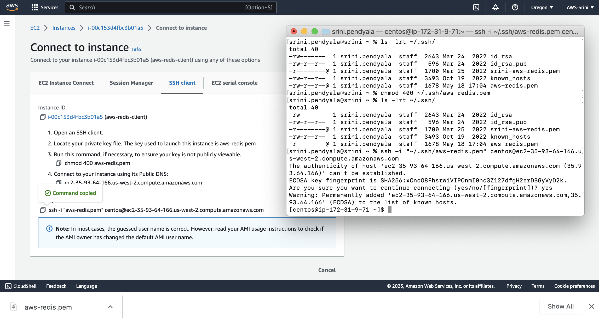

2. You will use the `docker-compose.yml` for spinning up Grafana docker container on the ec2 machine. To do this, run the following commands.

```
cd /home/centos/aws-fraud-detection
docker-compose up
```
> Leave this SSH Terminal window up and running. Please DO NOT exit out of this terminal. This will keep the Docker containers up and running for you to access Grafana Dashboards.

3. Lets install Terraform on your EC2 client machine. You can download Terraform by following instructions given [here](https://developer.hashicorp.com/terraform/downloads)

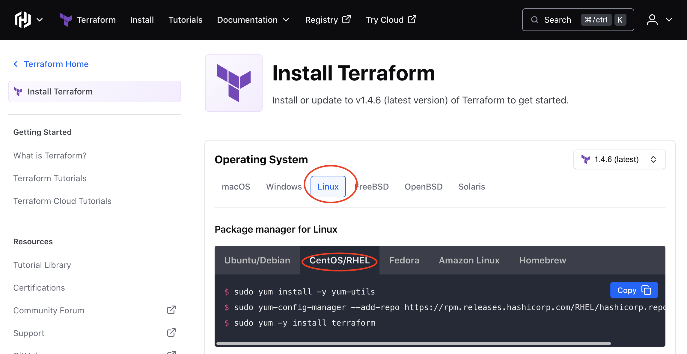

For example, for our EC2 machine that is running `CentOS`, the instructions are below:
Open a seperate Terminal SSH window and run these commands to install Terraform.

```
sudo yum install -y yum-utils
sudo yum-config-manager --add-repo https://rpm.releases.hashicorp.com/RHEL/hashicorp.repo
sudo yum -y install terraform
```
4. Next, edit the `terraform\grafana.tf` to reflect Redis Enterprise Cloud endpoint ( Hostname: Port). Search for `grafana_data_source` section and update the Redis endpoint, given by your instructor.


5. Using terraform, we are going to install Redis data source plugin in the Grafana docker container and also setup Grafana dashboards. To do this, run the following commands.

```
cd terraform
terraform init
```
The typical output may look like this:

```
[centos@ip-172-31-9-71 terraform]$ terraform init

Initializing the backend...

Initializing provider plugins...
- Finding latest version of grafana/grafana...
- Installing grafana/grafana v1.40.1...
- Installed grafana/grafana v1.40.1 (signed by a HashiCorp partner, key ID 570AA42029AE241A)

Partner and community providers are signed by their developers.
If you'd like to know more about provider signing, you can read about it here:
https://www.terraform.io/docs/cli/plugins/signing.html

Terraform has created a lock file .terraform.lock.hcl to record the provider
selections it made above. Include this file in your version control repository
so that Terraform can guarantee to make the same selections by default when
you run "terraform init" in the future.

Terraform has been successfully initialized!

You may now begin working with Terraform. Try running "terraform plan" to see
any changes that are required for your infrastructure. All Terraform commands
should now work.

If you ever set or change modules or backend configuration for Terraform,
rerun this command to reinitialize your working directory. If you forget, other
commands will detect it and remind you to do so if necessary.
```

7. Now lets apply the changes.

```
terraform apply
```
Please respond a 'yes' if there is a prompt asking you to go forward.

8. Once the containers are up and running, fire up a browser and point it to :
http://<ec2-server-hostname>:3000

Example: `http://ec2-35-93-64-166.us-west-2.compute.amazonaws.com:3000`

If you are unable to access your Grafana Dashboard, you may have to edit your Security Group configurations to allow http traffic on port 3000.

9. To configure `security groups` go to the EC2 machine properties page and click on `Security`

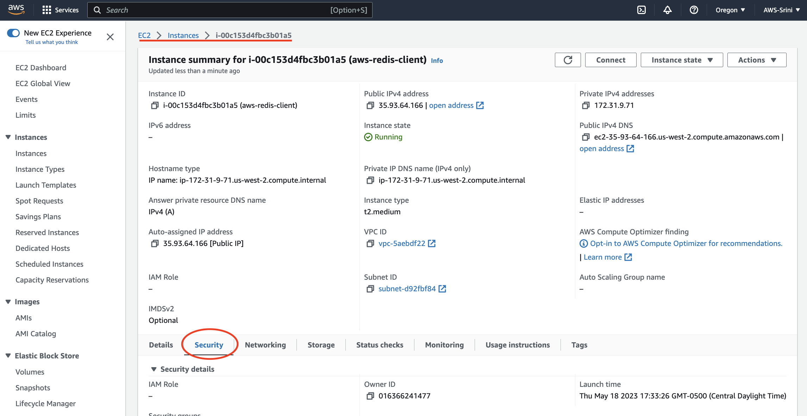

10. Click on the `Security Groups` attached to this EC2 machine.

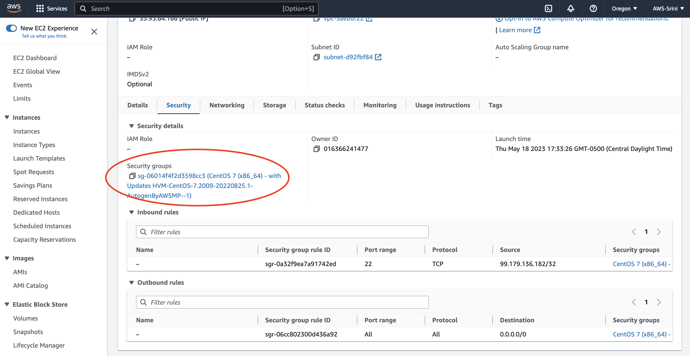

11. You will see the `EC2` ==> `Security Groups` page as shown below. Notice that there is `Inbound rules` tab and `Outbound rules` tab.
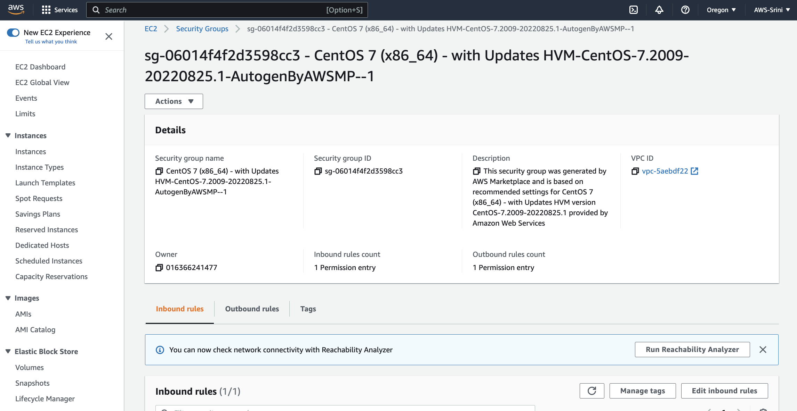

12. Click on the `Inbound rules` tab and click on the `Edit Inbound rules` button.

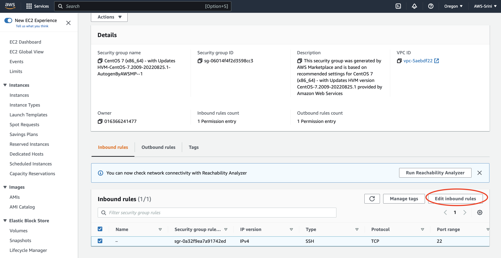

13. Add a rule that allows pretty much "All traffic" to reach from your local machine to the EC2 machine server.

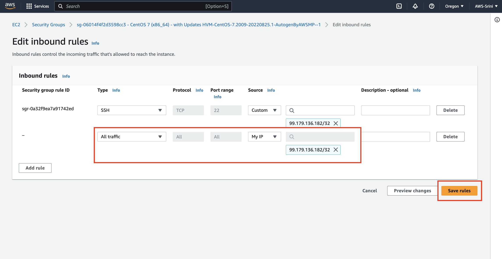

>IMPORTANT: The above setting is done purely for the demonstration purposes. Such settings are never recommended for Production environments.

14. Fireup the browser and go to `http://<your-ec2-server-hostname>:3000`. Simply type in `admin` \ `admin` for user credentials on this screen.

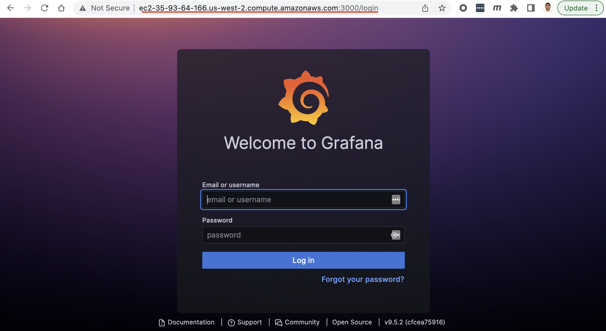

15. Skip resetting the password for now.

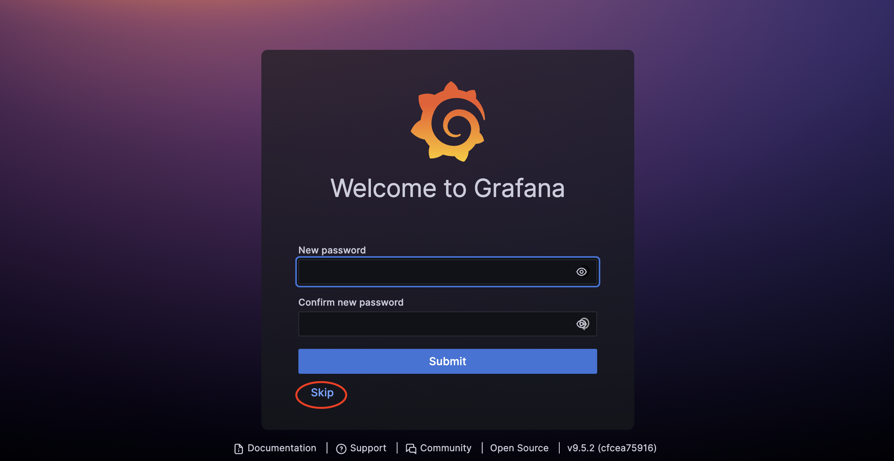

>IMPORTANT: The above setting is done purely for the demonstration purposes. Such settings are never recommended for Production environments.

16. Woho... You are logged in to Grafana now.

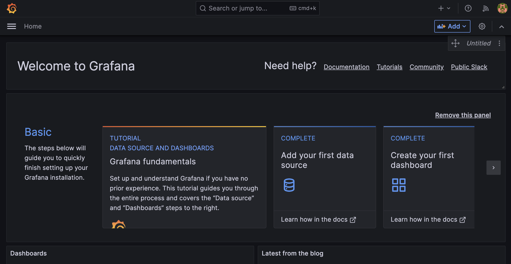

17. Navigate yourself from `Home` ==> `Connections` ==> `Your connections`, as shown below.

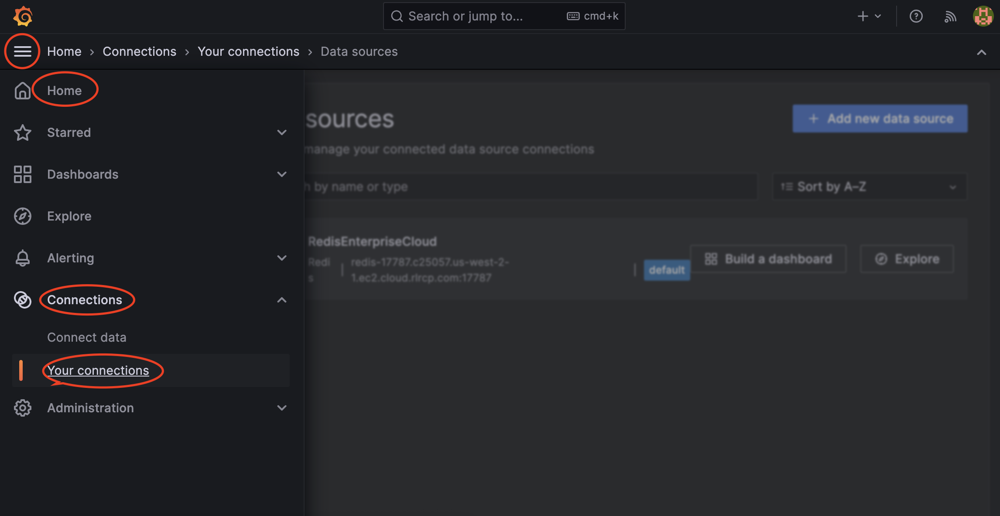

18. Click on `Data sources` and click on the `Redis Enterprise Cloud` configuration.

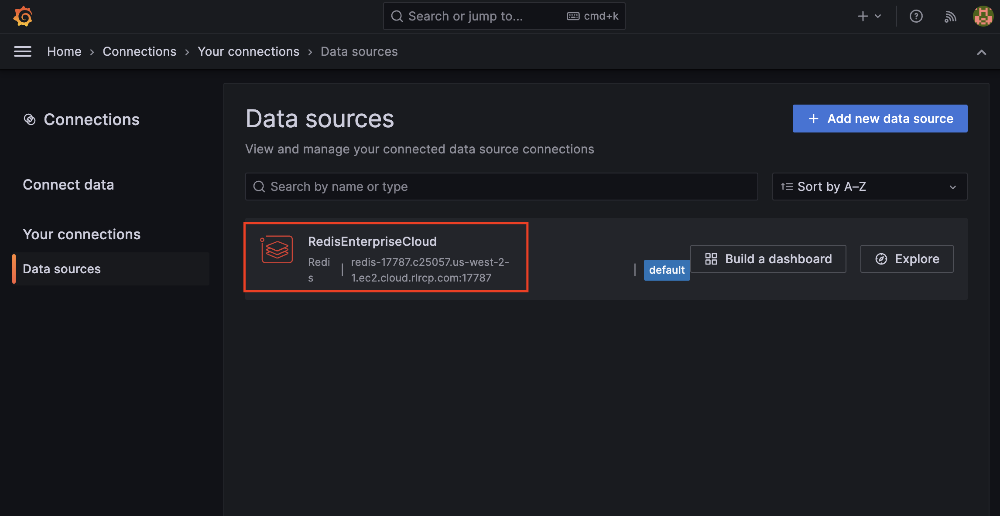

19. Make sure that the `Address` field is pointing to the Redis server host endpoint. Punch in the `database password` that your instructor provided.

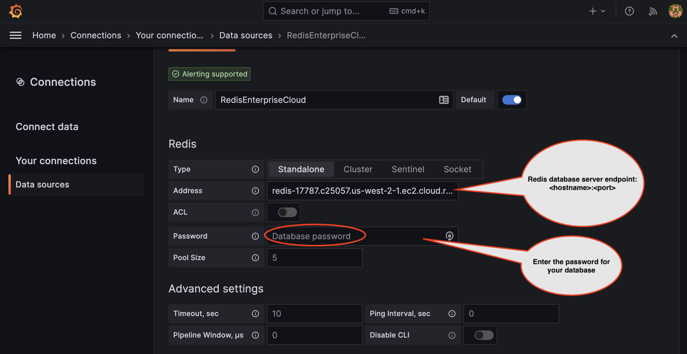

20. Click save and that should test the connection and ensures that it can reach the Redis endpoints successfully.

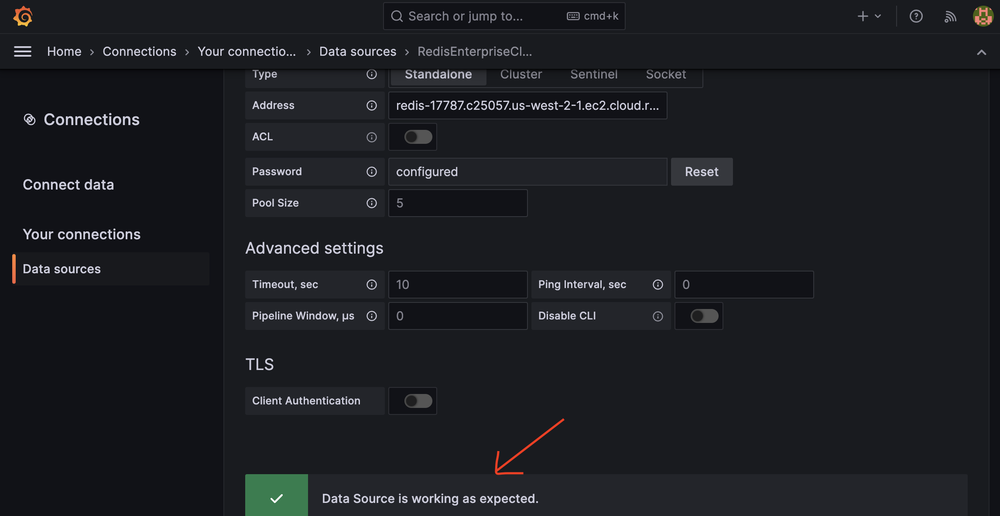

21. Navigate yourself `Home` ==> `Dashboards`, as shown below. Click on `FraudDetectionDashboard`

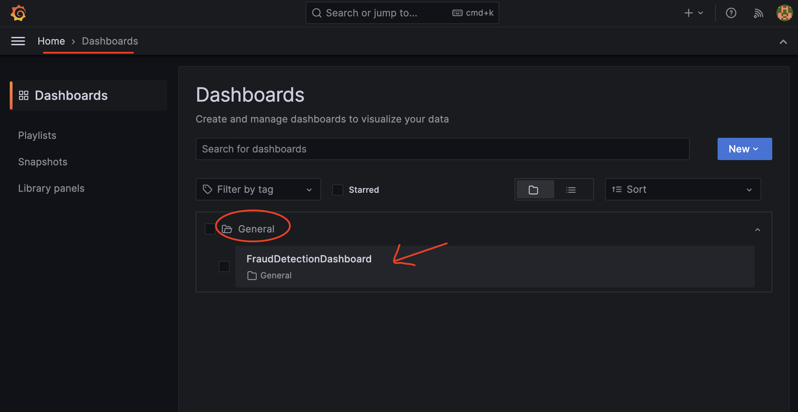

22. Yey... Now you have the Dashboard displaying Data visualization while your Fraud Detection system is inferencing and live scoring your transactions in real-time.

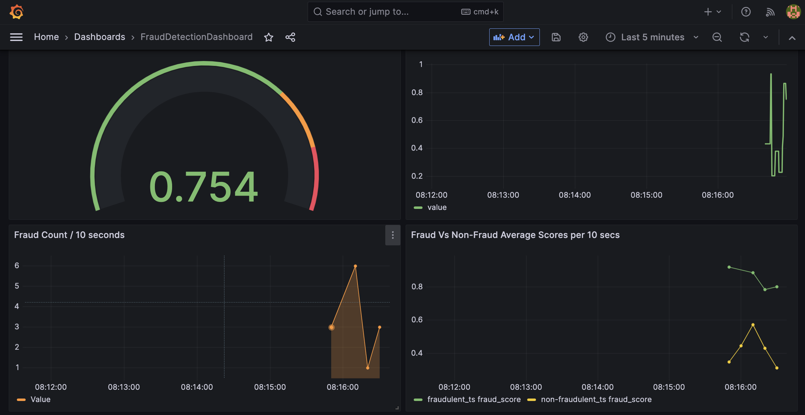

> Make sure your ec2-machine is continuosly emitting user transactions in a seperate SSH terminal window. Otherwise you may see these dashboards empty.

### If you have made this far, congratulate yourself for your perseverance to get through all of these exercises. Great Job indeed.


# Clean up Data Visualization components.

Clean up the Grafana Dashboard containers by running these commands.

```
terraform destroy
docker-compose down
```
