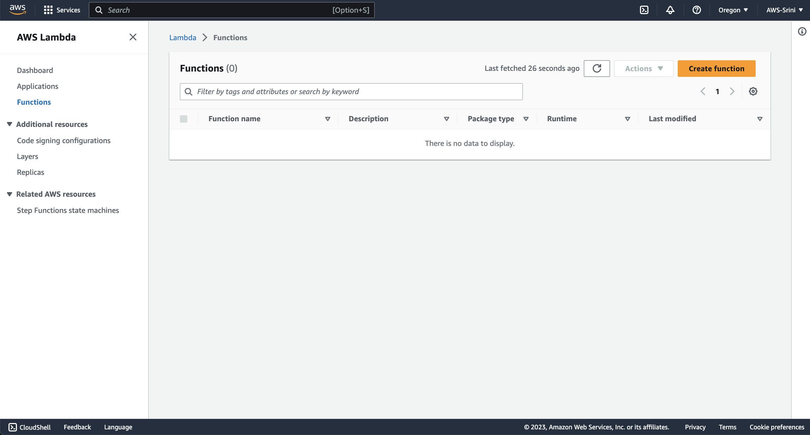
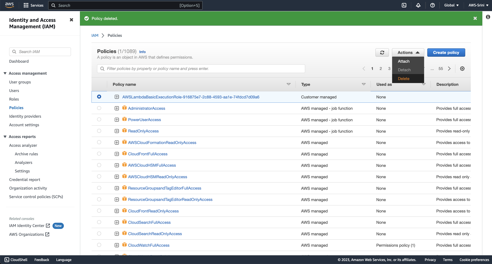

# Lab 07 - Cleanup

Duration: 15 mins

We deployed a lot of resources in these labs.  Clearly, you want to make sure they don't run up a bill from unused AWS resources.  This lab will help you clean up the resources you provisioned.

## The Nuclear Option
If you really want to stop AWS billing, close your AWS account.  If you've already stopped your active VMs and other cloud resources, you could still close your account to make very sure no additional charges are incurred.  Alternatively, in the rest of the lab, we'll walk through options that will allow you to continue to experiment and play with AWS.  But, if you prefer the nuclear approach, follow the instructions [here](https://aws.amazon.com/premiumsupport/knowledge-center/close-aws-account/).

# Cleaning up the resources

1.Go to `CloudFormation` service.

2. Delete it.

3. Delete the stack.

4. Delete initiated message confirms the process.

5. You can check in the `Resources` tab to ensure all cloud resources are deleted.

6. `Stack Info` tab indicates the status. In this case, its `DELETE_IN_PROGRESS`

7. At times, you may encounter `DELETE_FAILED`. In that case, go to `Resources`

8. Identify the failed resource. IN this case, it seems to be an S3 bucket. You can click on the link to open the page in a different window.

9. You see an S3 bucket with contents in it. Click on this resource to see the contents inside the object.

10. Select all these objects and click Delete button to delete these resources.

11. Confirm deletion and delete the objects.

12. Upon successful confirmationn, close this screen and go back to the bucket.

13. Go further one level up.

14. Now select this bucket and click on `Delete` button.

15. Confirm deletion.

16. Now go back to the `CloudFormation` template and hit the Delete button again

17. Confirm deletion.

18. This time around the stack is completed deleted.

19. Hence if you go back to the CloudFormation stacks dashboard, you do not see any stack installed.

20. In the `Amazon SageMaker` ==> "Training Jobs" page, these training jobs that were already run and completed, will still be there. There is no way to delete them at the moment.

21. Lets go to the `Models` and delete the models. Select and click `Delete` from `Actions` menu.

22. Delete the model.

23. Confirm

24. Now you have all of the models deleted.

25. Similary delete endpoint configurations

26. Just do it.

27. Go ahead and delete the other one too.

28. All done with the end point configurations.

29. Lets do the same for `Endpoints`

30. Go for it.

31. Why think twice. Just do it.

32. No mercy. Just do it. Delete the Lambda function.

33. Yes.Delete.

34. All empty. No more lambda functions.

35. Also lets delete the `Elstic Container Registry` Repository.

36. Just delete.

37. Yes.

38. All gone.

39. Go to IAM roles.

40. Select the role that was created by your lambda function. In this case: `aws-redis-fraud-detection-processor-role-ddsfsfds`.

41. Similarly delete AWS Lambda Basic Execution Role policies.

42. Lets also delete the EC2 machine. Go to ec2.

43. Terminate the instance.

44. Delete the S3 bucket that had the cloud formation template in it.

You are pretty much done  [Go back](..)
